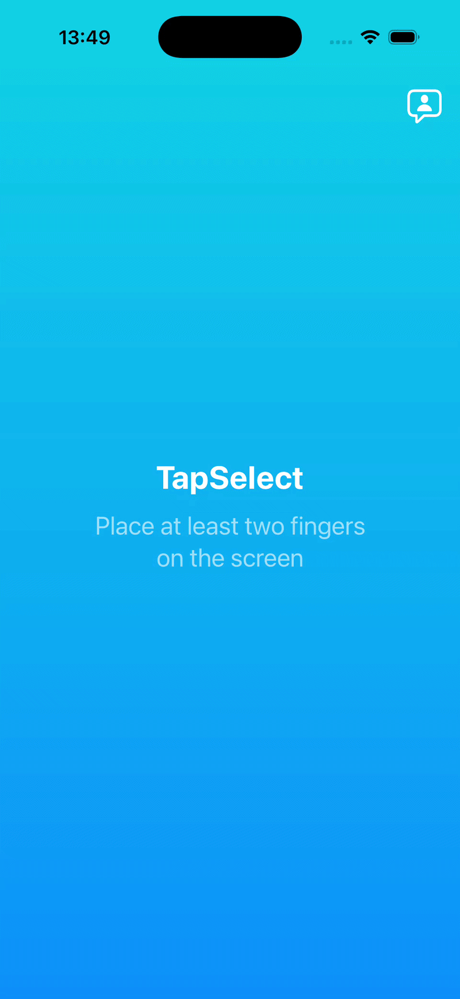

# TapSelect

A native iOS app that randomly selects one finger from multiple simultaneous touches. It's perfect for deciding who goes first in a board game, picking a volunteer or settling any group decision fairly.

## How It Works

1. Everyone places a finger on the screen at the same time
2. A 3-second countdown begins automatically
3. One finger is randomly selected and highlighted
4. Lift all fingers to reset and start a new round

Up to **5 fingers** can participate in a single round. Adding or removing a finger during the countdown restarts it from the beginning.

## Visual

## Requirements

- iOS 18.0+
- Xcode 26+

## Architecture

TapSelect is built with the [Composable Architecture (TCA)](https://github.com/pointfreeco/swift-composable-architecture) by Point-Free. All app state lives in a single `SelectionFeature` reducer, side effects are modelled as controlled dependencies and the UI is a pure function of state.

### Dependency Clients

| Client | Responsibility |
|--------|---------------|
| `AudioClient` | Plays sound effects via `AVFoundation` |
| `FeedbackClient` | Triggers haptic feedback via `UIImpactFeedbackGenerator` |
| `StoreKitClient` | Requests an App Store review |
| `UserDefaultsClient` | Persists lightweight values |

## Tech Stack

| Technology | Usage |
|------------|-------|
| **SwiftUI** | Declarative UI |
| **Composable Architecture** | State management & side effects |
| **Swift Concurrency** | `async`/`await`, `Clock`, structured effects |
| **AVFoundation** | Audio playback |
| **UIKit** | Multi-touch event handling, haptics |
| **StoreKit** | App Store review prompt |

## Open Source Dependencies

| Package | Version |
|---------|---------|
| [swift-composable-architecture](https://github.com/pointfreeco/swift-composable-architecture) | 1.25.5 |
| [swift-dependencies](https://github.com/pointfreeco/swift-dependencies) | 1.12.0 |
| [swift-case-paths](https://github.com/pointfreeco/swift-case-paths) | 1.7.3 |
| [swift-clocks](https://github.com/pointfreeco/swift-clocks) | 1.0.6 |
| [swift-collections](https://github.com/apple/swift-collections) | 1.5.0 |
| [swift-concurrency-extras](https://github.com/pointfreeco/swift-concurrency-extras) | 1.3.2 |
| [swift-custom-dump](https://github.com/pointfreeco/swift-custom-dump) | 1.5.0 |
| [swift-identified-collections](https://github.com/pointfreeco/swift-identified-collections) | 1.1.1 |
| [swift-navigation](https://github.com/pointfreeco/swift-navigation) | 2.8.0 |
| [swift-perception](https://github.com/pointfreeco/swift-perception) | 2.0.10 |
| [swift-sharing](https://github.com/pointfreeco/swift-sharing) | 2.8.0 |
| [combine-schedulers](https://github.com/pointfreeco/combine-schedulers) | 1.2.0 |
| [xctest-dynamic-overlay](https://github.com/pointfreeco/xctest-dynamic-overlay) | 1.9.0 |

## Author

Developed by **Dr. Stefan Lahme**, iOS Engineer with a focus on native iOS development.

- [LinkedIn](https://linkedin.com/in/stefan-lahme/)
- [GitHub](https://github.com/swift0r/)

---

*Designed and developed with ❤️*
